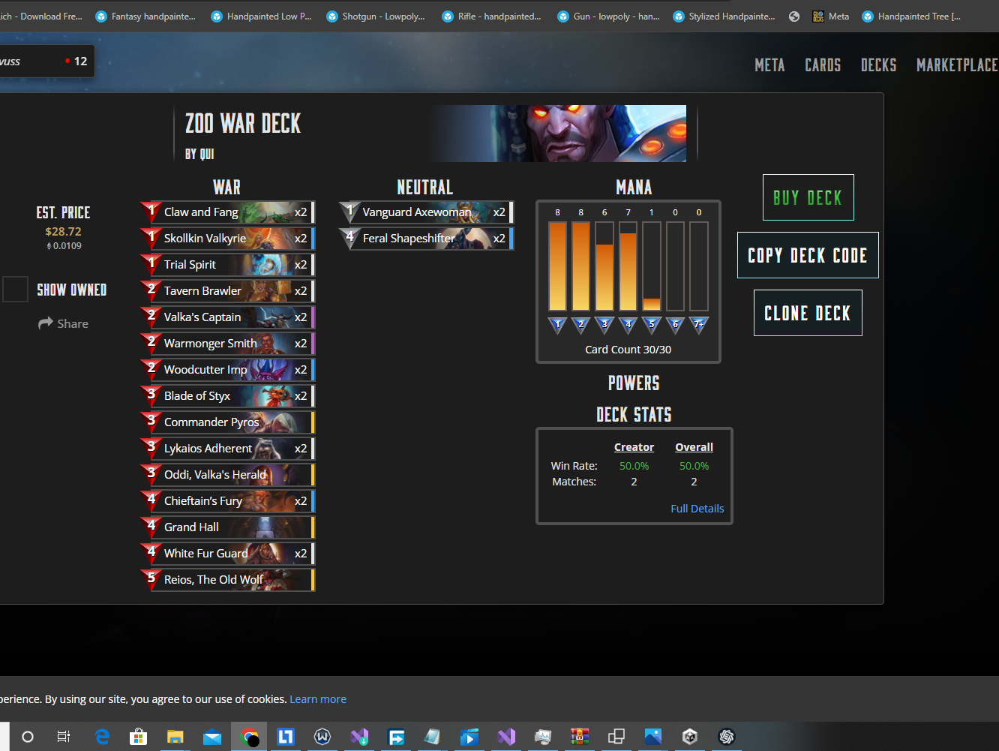

This is A Tool That Will Check Gods Unchained Debug Log For You.
This tool automatically opens your opponent's GUDecks.com profile as soon as a match begins, giving you instant access to their deck and performance data. This feature is designed to provide you with strategic insights in real-time, helping you make informed decisions during your match.

First It Automatically Detects the Oppoments When Match Starts

Then It Automatically Opens a Browser Tab and Go to Your Oppoment's Gu Decks Profile

from there you can see his latest deck according to his god and all the cards he have.

Enjoy. 100% Free and Safe. You Can See the source code.
